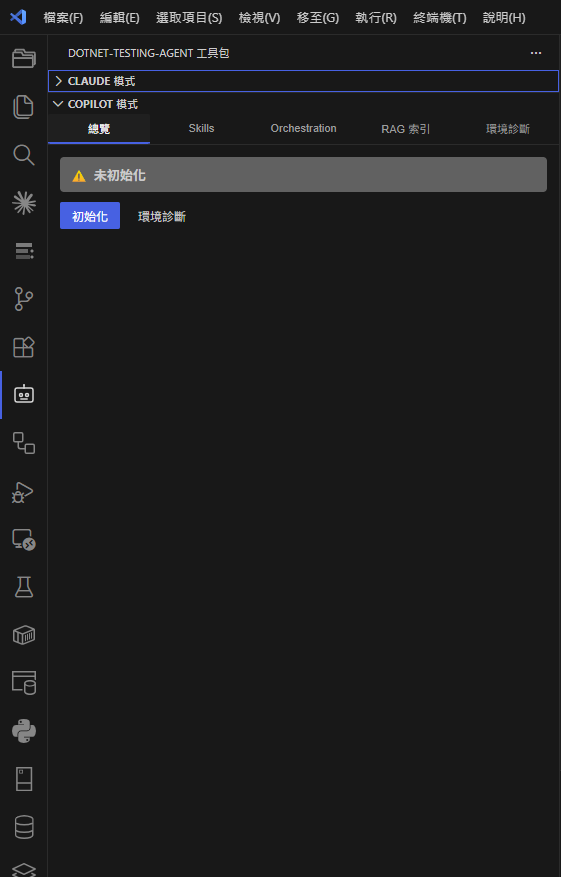
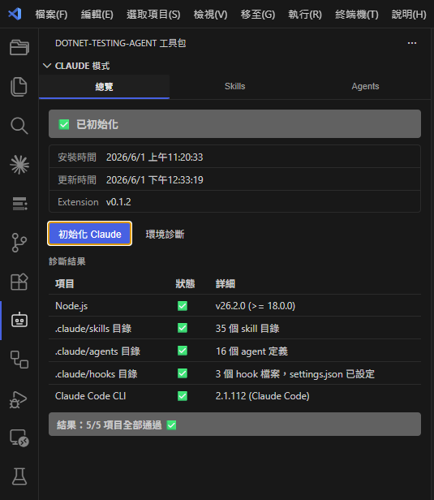
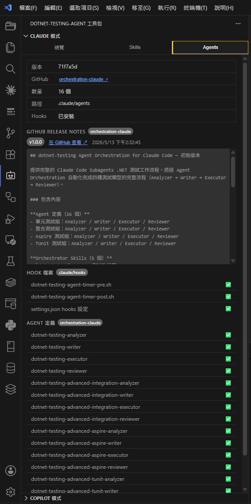
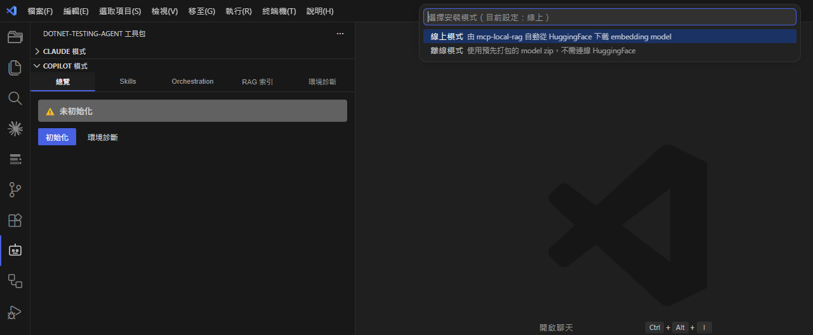
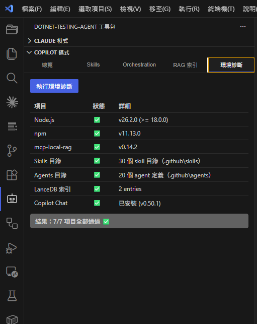
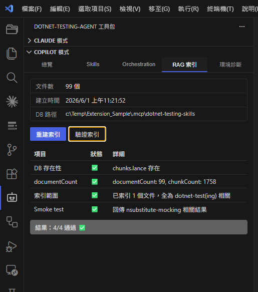

# dotnet Testing Agent — VS Code Extension

> 一鍵設定 AI 輔助 .NET 測試開發環境。支援 **Claude Code** 與 **GitHub Copilot** 兩種模式。

[](https://github.com/kevintsengtw/dotnet-testing-agent-vscode-extensions/releases)


> 📦 本頁為 **發布頁**，提供 `.vsix` 安裝檔與各版本安裝文件下載；不含原始碼。



---

## 這是什麼

一個給 .NET 開發人員的 VS Code Extension，讓你**一鍵**完成 AI 輔助測試開發環境設定：自動部署測試專用的 **Agent Skills**、**Orchestration** 流程定義檔，並（Copilot 模式）建立 **RAG 索引服務**，讓 AI Coding Agent 具備 .NET 測試開發的領域知識。

- 測試框架約束：**AwesomeAssertions**（非 FluentAssertions）、**NSubstitute**（非 Moq）
- 目標環境：Windows 10/11 與 macOS（皆完整支援），Linux 實驗性支援

自 **v0.2.0** 起，Claude 與 Copilot 兩種模式整合為**單一 extension**，安裝一份 `.vsix` 即可同時使用，於 Activity Bar 的「dotnet-testing-agent 工具包」面板中切換。

---

## 兩種模式

| | Claude 模式 | Copilot 模式 |
| --- | --- | --- |
| 搭配的 AI 工具 | Claude Code CLI | GitHub Copilot Chat（Agent 模式） |
| 部署路徑 | `.claude/`（skills、agents、hooks） | `.github/`（skills、agents） |
| RAG 索引 | ❌ 不需要 | ✅ 需要（mcp-local-rag + LanceDB） |
| 初始化指令 | `初始化 Claude 模式` | `初始化 .NET Testing Agent` |
| 安裝步驟 | 4 步驟 | 6 步驟 |
| Orchestration 來源 | [dotnet-testing-agent-orchestration-claude](https://github.com/kevintsengtw/dotnet-testing-agent-orchestration-claude) | [dotnet-testing-agent-orchestration](https://github.com/kevintsengtw/dotnet-testing-agent-orchestration) |

兩種模式部署路徑與 manifest 完全獨立，互不干擾，可只用其中一種或兩種並用。兩者皆使用共用的 [dotnet-testing-agent-skills](https://github.com/kevintsengtw/dotnet-testing-agent-skills)；差異在於 Orchestration 定義（Agents / Hooks 等）各自來自上表對應的 repo。Claude 模式的 Skills / Agents / Hooks 即來自 [dotnet-testing-agent-orchestration-claude](https://github.com/kevintsengtw/dotnet-testing-agent-orchestration-claude)。

---

## 前置需求

| 項目 | 最低版本 |
| --- | --- |
| VS Code | 1.85.0 |
| Node.js | 18.0.0 |
| 作業系統 | Windows 10/11、macOS（皆完整支援）；Linux 實驗性支援 |

依使用模式擇一：

| 模式 | 額外需求 |
| --- | --- |
| Claude 模式 | Claude Code CLI |
| Copilot 模式 | GitHub Copilot Chat（最新版、已登入） |

---

## 安裝

1. 前往 [Releases](https://github.com/kevintsengtw/dotnet-testing-agent-vscode-extensions/releases) 下載最新版 `dotnet-testing-agent-<版本>.vsix`
2. 安裝：

   **方法一：Extensions 面板**
   - 開啟 Extensions 面板（Windows/Linux：`Ctrl+Shift+X`；macOS：`Cmd+Shift+X`）→ 右上角 `...` → **Install from VSIX...** → 選擇下載的 `.vsix`

   **方法二：命令列**
   ```bash
   code --install-extension dotnet-testing-agent-<版本>.vsix
   ```

---

## 快速開始

安裝後，Activity Bar 會出現「dotnet-testing-agent 工具包」圖示，側邊欄含 **Claude 模式** 與 **Copilot 模式** 兩個面板。

> 快捷鍵對照：命令面板 — Windows/Linux `Ctrl+Shift+P`、macOS `Cmd+Shift+P`；Copilot Chat — Windows/Linux `Ctrl+Alt+I`、macOS `Cmd+Ctrl+I`。

### Claude 模式

1. 開啟命令面板（Windows/Linux：`Ctrl+Shift+P`；macOS：`Cmd+Shift+P`）→ 執行 `dotnet-testing 測試工作流程: 初始化 Claude 模式`
2. 等待 4 個步驟完成（部署 Skills / Agents / Hooks 至 `.claude/`）

完成後可在側邊欄查看部署狀態與環境診斷：



<details>
<summary>Claude 模式部署的 Agents 與 Hooks 清單</summary>



</details>

### Copilot 模式

1. 開啟命令面板（Windows/Linux：`Ctrl+Shift+P`；macOS：`Cmd+Shift+P`）→ 執行 `dotnet-testing 測試工作流程: 初始化 .NET Testing Agent`
2. 選擇安裝模式（線上 / 離線）

   

3. 等待 6 個步驟完成
4. 開啟 Copilot Chat（Windows/Linux：`Ctrl+Alt+I`；macOS：`Cmd+Ctrl+I`）→ 切換 **Agent** 模式 → 點選工具圖示（🔨）→ 確認 `dotnet-testing-skills` 已啟用

完成後可在側邊欄執行環境診斷確認：



<details>
<summary>驗證 RAG 索引狀態</summary>



</details>

> 各版本的詳細安裝指南見 [`docs/`](docs/) 目錄。

---

## 相關專案

| Repo | 說明 |
| --- | --- |
| [dotnet-testing-agent-skills](https://github.com/kevintsengtw/dotnet-testing-agent-skills) | .NET 測試 Agent Skill 定義檔（兩種模式共用） |
| [dotnet-testing-agent-orchestration-claude](https://github.com/kevintsengtw/dotnet-testing-agent-orchestration-claude) | **Claude 模式**的 Orchestration 定義（skills / agents / hooks） |
| [dotnet-testing-agent-orchestration](https://github.com/kevintsengtw/dotnet-testing-agent-orchestration) | **Copilot 模式**的 Agent Orchestration 流程定義 |
| [dotnet-testing-agent-skills-samples](https://github.com/kevintsengtw/dotnet-testing-agent-skills-samples) | 搭配 Skills 的範例專案 |

---

## 授權

[MIT](LICENSE)
